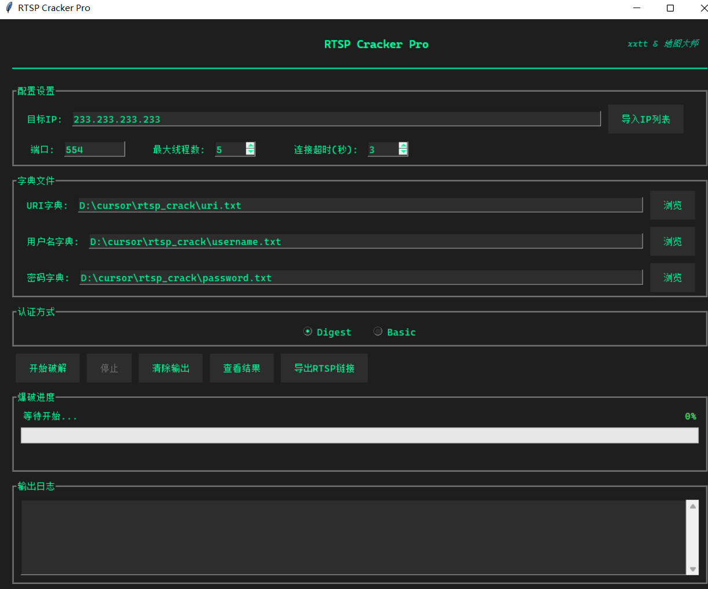

# 🎯 RTSP Cracker Pro

> 一款颜值与实力并存的RTSP设备安全测试工具

RTSP Cracker Pro 是一个用于RTSP设备安全测试的现代化图形工具。告别命令行的繁琐操作，让安全测试变得简单优雅。无论你是安全研究人员、网络工程师，还是安全爱好者，这都将是你的得力助手。



## ✨ 为什么选择 RTSP Cracker Pro？

- 🎨 **颜值即正义** - 现代化UI设计，简洁优雅的操作界面
- 🚀 **快如闪电** - 多线程并发处理，效率提升数倍
- 🛠️ **功能强大** - 支持多种认证方式，自动URI探测
- 🎯 **精准可靠** - 实时显示破解进度，结果一目了然
- 📦 **开箱即用** - 无需安装依赖，纯Python标准库实现
- 🔄 **持续更新** - 定期维护更新，解决用户反馈

## 🔧 功能特点

- 💫 支持Basic和Digest双认证模式
- 📝 支持批量导入IP列表
- 🔍 智能URI路径探测
- 📊 实时进度显示
- 💾 一键导出结果
- 🔗 快捷RTSP链接生成
- 📋 剪贴板快速复制
- 🎨 现代化界面设计

## 🚀 快速开始

### 环境要求

- Python 3.7+
- 无需任何第三方库！

### 三步开始使用

1️⃣ 克隆仓库：

```bash
git clone https://github.com/yourusername/rtsp-cracker-pro.git
cd rtsp-cracker-pro
```

2️⃣ 运行程序：

```bash
python rtsp_crack_gui.py
```

3️⃣ 开始破解！

## 📚 使用指南

### 🎯 基本配置

1. **目标配置**

   - 🔹 单个IP测试：直接输入目标IP
   - 🔹 批量IP测试：导入IP列表文件
   - 🔹 自定义端口：默认554，可按需修改
2. **字典配置**

   - 🔹 URI字典：设备访问路径字典
   - 🔹 用户名字典：可能的用户名列表
   - 🔹 密码字典：可能的密码列表
3. **认证方式**

   - 🔹 Digest认证：默认模式，更安全
   - 🔹 Basic认证：兼容老设备

### 🎮 操作流程

1. 设置目标IP（单个/批量）
2. 选择字典文件（URI/用户名/密码）
3. 选择认证方式
4. 点击开始，坐等结果！

### 📊 结果管理

- 📋 实时查看破解结果
- 💾 导出RTSP链接
- 📎 一键复制到剪贴板
- 📑 详细信息导出

## 📝 字典文件格式

简单直观的纯文本格式：

```text
# uri.txt - URI路径字典
/
/11
/12
/h264/ch1/main/av_stream
/cam/realmonitor

# username.txt - 用户名字典
admin
root
supervisor

# password.txt - 密码字典
12345
admin123
password
```

## 🎬 使用技巧

- 💡 合理控制线程数，建议5-10个
- 💡 定期更新字典库，提高成功率
- 💡 使用前先测试单个IP
- 💡 注意保存重要的破解结果

## ⚠️ 注意事项

- 🚫 仅用于授权的安全测试
- 📌 建议备份重要字典文件
- ⚡ 注意控制并发数量
- 🔒 遵守相关法律法规

## 👥 关于我们

- 🧙‍♂️ **xxtt** - *核心开发*
- 🎨 **地图大师returnwrong**- *核心开发*

## 🤝 参与贡献

我们欢迎各种形式的贡献：

- 🐛 提交Bug报告
- 💡 新功能建议
- 📝 完善文档
- 🔧 提交代码

## 📜 许可证

MIT License - 详见 [LICENSE](LICENSE) 文件

## ⚠️ 免责声明

免责声明与用户协议
1. 重要提示
请在下载、安装、使用或修改本工具及相关代码（以下简称“本工具”）之前，仔细阅读本协议的所有条款。
若您不同意本协议的任何内容，请勿下载、安装或使用本工具。您的下载、安装、使用、修改等行为即视为您已阅读、理解并同意受本协议约束。

2. 责任声明
2.1. 本工具仅用于学习、研究及合法测试用途，不得用于任何非法目的。
2.2. 您应确保自身的行为符合适用法律法规，如因使用本工具产生任何法律责任或不良后果，您需自行承担全部责任，与本工具开发者无关。
2.3. 在使用本工具的过程中，如造成您自身或他人的任何损失、损害（包括但不限于数据丢失、设备损坏、法律责任等），本工具开发者概不负责。

3. 合法合规使用
3.1. 您不得利用本工具进行未经授权的渗透测试、数据窃取、网络攻击、非法入侵等违法行为。
3.2. 若您在使用本工具时违反法律法规或侵犯第三方权益，您需自行承担法律责任，开发者不承担任何直接或间接责任。

4. 协议生效与更新
4.1. 本协议自您下载、安装、使用本工具之时生效。
4.2. 开发者保留随时修改本协议的权利，更新后的协议将在适当渠道发布，不再另行通知。如您继续使用本工具，即视为接受更新后的协议。

---

如果觉得这个工具对你有帮助，请给个 Star ⭐️ 支持一下！

[反馈问题] 地图大师微信  returnwrong
